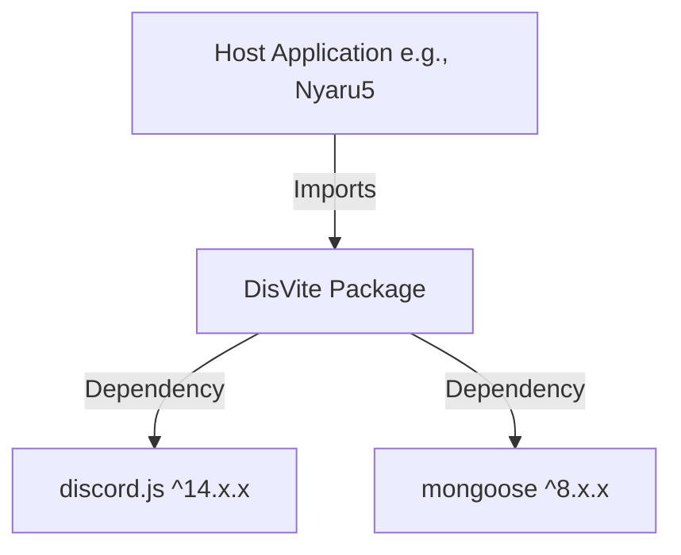

# DisVite Code Architecture & Guidelines

This document outlines the codebase architecture, module configuration, dependency analysis, error-handling conventions, and coding guardrails for the `disvite` (discord-invite-tracker) npm package. All maintainers and automated agents must adhere to these specifications.

---

## 1. Module Type & Targeting

The library is structured as a modern TypeScript-first codebase compiled to standard CommonJS format.

| Specification | Target Details |
| :--- | :--- |
| **Language** | TypeScript (v5.x.x) |
| **Module Format** | CommonJS (CJS) output compiled via `tsc` (default fallback as `"type": "module"` is absent in `package.json`) |
| **Compilation Targets** | JavaScript ES2020 (`"target": "ES2020"` in `tsconfig.json`) |
| **Declaration Outputs** | Generated TypeScript definitions (`.d.ts`) exported via the `"types": "dist/index.d.ts"` field |
| **discord.js Target** | Major version v14 (`"discord.js": "^14.x.x"`) |
| **mongoose Target** | Major version v8 (`"mongoose": "^8.x.x"`) |

### Key Files Checked
* [package.json](file:///d:/Projects/NPM/discord-invite-tracker/package.json): Defines main entrypoint (`dist/index.js`), types, dependencies, and build scripts.
* [tsconfig.json](file:///d:/Projects/NPM/discord-invite-tracker/tsconfig.json): Dictates strict type checking, ES2020 targeting, and CommonJS module output.

---

## 2. Public API Surface

`disvite` exports a unified programmatic API surface. The main entry point is a class-based architecture that utilizes EventEmitters to notify parent applications about invite activity.

### The Main Class: `InviteTracker`
The primary export of the package is the `InviteTracker` class, which extends Node's native `EventEmitter`.

#### Class Constructor
```typescript
constructor(
    client: Client,
    mongoURI: string,
    options?: Types.InviteTrackerOptions
)
```
* **Parameters**:
  * `client`: A `discord.js` `Client` instance.
  * `mongoURI`: The MongoDB connection string used to connect to database using Mongoose.
  * `options`: Config options (`modelName?: string`, `verbose?: boolean`).

#### Public Properties & Cache
* **`client: Client`**: Exposes the discord client reference passed during initialization.
* **`invites: Map<string, Collection<string, number>>`**: In-memory cache mapping `GuildId` to a collection of invite codes and their respective `uses` count.

#### Event Hooks
The module communicates actions back to the host application by emitting custom events:
1. **`inviteJoin`**: Emitted when a user joins a guild.
   * **Arguments**:
     * `member`: `GuildMember` (the user who joined).
     * `inviteInfo`: `Types.InviteInfo` (containing invite code, inviter user ID, join type, fake status, and timestamps).
2. **`inviteLeave`**: Emitted when a user leaves a guild.
   * **Arguments**:
     * `member`: `GuildMember` (the user who left).
     * `joinRecord`: `Types.InviteSchema & Document` (the database entry updated with the `leftAt` timestamp).

#### Schema & Types Exports
The library re-exports all TypeScript interfaces and types defined in [types.ts](file:///d:/Projects/NPM/discord-invite-tracker/src/types.ts) via `export * from "./types"` in `src/index.ts`.

---

## 3. Dependency Overhead & Design Audit

The package footprint is minimal but highlights design choices that could introduce overhead or conflicts in parent applications:



### Dependency Audit
1. **`discord.js` (`^14.x.x`)**:
   * *Status*: Hard dependency.
   * *Overhead*: Critical peer package overlap.
   * *Issue*: Defining `discord.js` as a direct dependency instead of a `peerDependency` can lead to duplicate package installations if the host application uses a slightly different version of discord.js, potentially causing constructor mismatch or type errors.
2. **`mongoose` (`^8.x.x`)**:
   * *Status*: Hard dependency.
   * *Overhead*: Very heavy library.
   * *Issue*: Establishing a separate mongoose connection (`mongoose.connect(mongoURI)`) in the library constructor bypasses and conflicts with existing database connections managed by the host application (like Nyaru5). This pattern can create redundant connection pools.

### Optimization Recommendations
> [!TIP]
> * **Shift to Peer Dependencies**: Transition `discord.js` and `mongoose` to `peerDependencies` in `package.json` so the host application dictates the precise library version.
> * **Support Connection Sharing**: Update `InviteTracker` to optionally accept an existing Mongoose `Connection` object, rather than forcing a connection via `mongoURI` in the constructor. This avoids polluting global mongoose state.

---

## 4. Library Error Bubbling & Lifecycle Logging

Currently, `disvite` handles logging by conditionally checking `this.options?.verbose` and invoking standard `console` output:

```typescript
if (this.options?.verbose) {
    console.error("DisVite: Failed to connect to MongoDB\n", error);
}
```

### Critical Logging and Error Flaws
* **stdout Pollution**: Libraries should not write directly to `console.log`, `console.info`, `console.warn`, or `console.error`. This pollutes the host application's logs and prevents structured loggers (e.g. Winston or Pino) from formatting or intercepting them.
* **Uncaught Promise Rejections in Constructor**: In `src/index.ts`, `connectToDatabase` is an asynchronous method, but it is called synchronously from the constructor without chaining `.catch(...)`:
  ```typescript
  constructor(...) {
      ...
      this.connectToDatabase(mongoURI); // Called synchronously, fire-and-forget
      this.initialize();
  }
  ```
  If all 3 connection attempts fail, `connectToDatabase` throws an error:
  ```typescript
  throw new Error("DisVite: MongoDB connection impossible.");
  ```
  Because this throws within an unawaited asynchronous context called by the synchronous constructor, it causes an **Unhandled Promise Rejection**, which can crash the parent process.

### Correct Error Bubbling Guidelines
To allow parent applications (like Nyaru5) to catch, handle, and log errors securely, follow these protocols:
1. **Propagate Errors via Events**: Instead of using `console.error`, emit an `"error"` event:
   ```typescript
   this.emit("error", new Error("DisVite: Failed to save invite data"));
   ```
2. **Expose Debug Hooks**: Emit a `"debug"` event for verbose warnings and trace logs:
   ```typescript
   this.emit("debug", "Fetched vanity data successfully.");
   ```
3. **Handle Connection Failures Gracefully**: Provide an asynchronous initialization flow (e.g., an `.init()` method) or handle constructor connection rejections by catching and emitting them through `this.emit("error", ...)`.

---

## 5. Library Guardrails

Maintainers and automated agents must adhere to the following 5 strict implementation rules when modifying the codebase:

### Rule 1: Strict Types and Visibility Modifiers
All code must be written in TypeScript with `"strict": true` compilation.
* **No `any`**: Explicit types must be declared for all variables, function parameters, and return types. Use interfaces/unions for complex shapes.
* **Visibility Modifiers**: Class properties and methods must explicitly specify their access level: `public`, `protected`, or `private`.
  ```typescript
  // CORRECT: Explicit visibility, precise types
  public async cacheGuildInvites(): Promise<void>
  
  // INCORRECT: Implicit visibility, missing return type
  async cacheGuildInvites()
  ```

### Rule 2: Securing the discord.js Client Reference
The library must treat the host application's discord.js `Client` reference as read-only.
* Do not attach monkey-patches, custom fields, or modify properties on the host `Client` instance.
* Use clean event registration methods (`client.on` or `client.once`) and clean them up if the class exposes a teardown/destructor method.

### Rule 3: Zero Console Output / Event-Driven Communication
Direct calls to the global `console` object (`console.log`, `console.error`, etc.) are strictly prohibited.
* For errors that the host application *must* handle (such as database failures), throw a standard `Error` or emit an `"error"` event.
* For trace, info, or warning statements, emit a `"debug"` or `"warn"` event so that parent loggers can handle them natively.

### Rule 4: Non-Blocking Constructor & Async Safety
Do not execute "fire-and-forget" asynchronous operations inside synchronous contexts (like the constructor) without safety catch handlers.
* Asynchronous calls in constructors must catch rejections locally and forward them to an `"error"` listener on the EventEmitter:
  ```typescript
  this.connectToDatabase(mongoURI).catch(err => this.emit("error", err));
  ```

### Rule 5: Preservation of Global Database Connections
Avoid side effects on global Mongoose instances.
* Do not call global Mongoose methods (like `mongoose.connect()`) if a custom connection options config exists.
* Future features must allow connecting models to specific Mongoose `Connection` instances (e.g., `connection.model(...)`) rather than using global `mongoose.model(...)` compile steps, preventing collisions with the parent application's schema registry.
