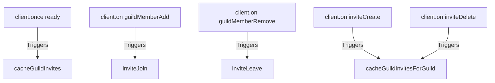

# Current State Audit & Bug Report

This document maps the active event handlers, logical vulnerabilities, tracking failures, and broken interfaces within the `disvite` npm library package.

---

## 1. Active Handlers

The module hooks into the `discord.js` gateway using five primary event listeners registered in `initialize()` inside [index.ts](file:///d:/Projects/NPM/discord-invite-tracker/src/index.ts#L62-L85):



* **`ready` (Once)**: Fires on bot startup to populate the in-memory invite cache for all cached guilds.
* **`guildMemberAdd` (On)**: Runs the main tracking comparison and increments logs when a member joins.
* **`guildMemberRemove` (On)**: Updates the database record to log when a user leaves the guild.
* **`inviteCreate` & `inviteDelete` (On)**: Synchronises the invite cache for the specific guild whenever invite codes are added or removed.

---

## 2. The Bug Audit (Vulnerabilities & Assumptions)

A deep review of the tracking mechanisms exposes several flaws and logic gaps:

### A. Missing Gateway Intent Validation
* **Vulnerability**: The module assumes the host client has the necessary gateway intents enabled.
* **Impact**: If the host client is missing `IntentsBitField.Flags.GuildMembers` or `IntentsBitField.Flags.GuildInvites`, events will never trigger or `guild.invites.fetch()` will throw permissions errors, causing a silent failure.

### B. Dynamic Guild Join Memory Leak & Tracking Gap
* **Vulnerability**: There is **no listener** for the `guildCreate` event. If the bot joins a new guild during runtime, its invites are never cached. 
* **Impact**: A member joining a newly added guild will trigger an `Unknown` join status fallback since no initial cached state exists.
* **Vulnerability**: There is **no listener** for `guildDelete`. 
* **Impact**: When the bot leaves a guild, the cached invites remain in the `this.invites` Map, creating a permanent memory leak in multi-guild bots.

### C. Race Conditions & Rate Limit Triggers
* **Vulnerability**: When a user joins, the module instantly triggers a REST API request `guild.invites.fetch()`.
* **Impact**: High-concurrency joins (e.g. during a raid or server push) will spark multiple concurrent API requests for the same guild. This will:
  1. Trigger Discord REST API rate limits (`429 Too Many Requests`).
  2. Cause race conditions where concurrent checks pull duplicate invite cache versions before the state has synced.
* **Note**: A comment placeholder exists: `// TODO: Add queue system to handle invite tracking in case of high traffic.` but no mechanism is implemented.

### D. Flawed and Fragile Vanity URL Tracking
* **Vulnerability**: Under [inviteJoin](file:///d:/Projects/NPM/discord-invite-tracker/src/index.ts#L177-L186), vanity URL code resolution relies on `guild.fetchVanityData()`, which is called directly without error handling:
  ```typescript
  const newVanityUses = (await guild.fetchVanityData()).uses || 0;
  ```
* **Impact**: If a guild disables its vanity URL or if the bot lacks the `ManageGuild` permission to read vanity statistics, `fetchVanityData()` will throw a API error, crashing the entire `inviteJoin` handler.
* **Vulnerability**: Redundant requests are made. In vanity resolutions, it queries `guild.fetchVanityData()` once to determine usage, and immediately queries it a *second* time (lines 191-192) to update the cache:
  ```typescript
  const latestVanityData = await guild.fetchVanityData();
  ```
* **Impact**: Unnecessary API calls increase rate-limiting risks.

---

## 3. Broken Interfaces & Crash Vectors

The current interfaces lack fundamental error wrapping and sanity checks, creating multiple vector vulnerabilities that can crash a host application:

### A. Non-Existent Error Safety on Discord REST Calls
In [index.ts](file:///d:/Projects/NPM/discord-invite-tracker/src/index.ts#L161), the call:
```typescript
const newInvites = await guild.invites.fetch();
```
is not wrapped in a `try...catch` block.
* **Crash Vector**: If the bot is missing `ManageGuild` or `ViewAuditLog` permissions (or if the guild has blocked invite queries), this REST call will throw an unhandled API error, crashing the host application.

### B. Database Query Crashes
In `inviteJoin()`, the database query for fake invite detection is awaited directly within the interface instantiation:
```typescript
const inviteInfo: Types.InviteInfo = {
    ...
    fake: await this.detectFakeInvite(member), // Unsafe await
    ...
};
```
Inside `detectFakeInvite()`, `this.inviteModel.find(...)` is executed.
* **Crash Vector**: If the MongoDB connection drops, is congested, or times out, this database query throws a Mongoose error, which halts the execution, bypasses event emission, and crashes the gateway handler.

### C. Mongoose OverwriteModelError
The model initialization helper in [inviteSchema.ts](file:///d:/Projects/NPM/discord-invite-tracker/src/inviteSchema.ts#L85-L89):
```typescript
export function getInviteModel(
	modelName: string = "inviteSchema"
): Model<InviteSchema & Document> {
	return mongoose.model<InviteSchema & Document>(modelName, InviteSchema);
}
```
attempts to compile the schema directly.
* **Crash Vector**: If the package is loaded multiple times (e.g. during hot-reloads, test runners, or microservice imports) or if the host app already defines an `inviteSchema` model name, Mongoose throws a fatal `OverwriteModelError`.
* **Fix**: Validate the model collection first: `mongoose.models[modelName] || mongoose.model(...)`.

### D. Synchronous-to-Asynchronous Constructor Break
As outlined in `CODE_ARCHITECTURE.md`, `connectToDatabase` is async but run fire-and-forget in the synchronous constructor:
```typescript
constructor(...) {
    ...
    this.connectToDatabase(mongoURI);
}
```
* **Crash Vector**: A failed database connection throws an exception that escapes the event loop as an **Unhandled Promise Rejection**, terminating host applications that do not ignore unhandled rejections.
